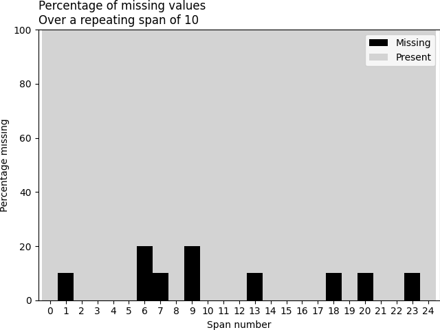

# Datos faltantes
_Uso de `None` en Python_
`print(None or True)`                         Retorna `True`, ya que `or` devuelve el primer valor verdadero.  
`print(None or False)`                        Retorna `False`, porque ambos valores son considerados "falsos".  
`print(None == None)`                         Retorna `True`, ya que `None` es igual a `None`.  
`print(None is None)`                         Retorna `True`, ya que `is` compara identidades en memoria.  
`print(type(None))`                           Retorna `<class 'NoneType'>`, que es el tipo de `None`.  

_Manejo de `np.nan` con NumPy_
`import numpy as np`                          Importa la librería NumPy.  
`print(np.nan or True)`                       Retorna `True`, porque `or` devuelve el primer valor verdadero.  
`print(np.nan == np.nan)`                     Retorna `False`, ya que `NaN` nunca es igual a sí mismo.  
`print(np.nan is np.nan)`                     Retorna `True`, porque `is` compara identidades en memoria.  
`print(np.nan / 2)`                           Retorna `nan`, ya que cualquier operación con `nan` sigue siendo `nan`.  
`print(type(np.nan))`                         Retorna `<class 'float'>`, ya que `np.nan` es un flotante.  
`print(np.isnan(np.nan))`                     Retorna `True`, porque `np.isnan()` detecta valores `nan`.  

_Manejo de Datos Faltantes con Pandas_
`import pandas as pd`                         Importa la librería Pandas.  
`test_missing_df = pd.DataFrame.from_dict(...)` Crea un DataFrame con valores faltantes (`np.nan`, `None`, `pd.NA`).  
`print(test_missing_df)`                      Muestra la tabla con los datos, donde `NaN` indica valores faltantes.  
`print(test_missing_df.isna())`               Devuelve un DataFrame con `True` donde hay valores faltantes.  
`print(test_missing_df.isnull())`             Funciona igual que `isna()`, detecta valores faltantes.  
`print(test_missing_df.x.isna())`             Devuelve una serie booleana indicando qué valores en la columna `x` están vacíos.  

_Creación de Series en Pandas con Datos Faltantes_
`print(pd.Series([1, np.nan]))`                             Crea una serie con un valor `1` y un `NaN`.  
`print(pd.Series([pd.to_datetime('2022-01-01'), np.nan]))`  Crea una serie con una fecha y un `NaN`.  
`print(pd.Series([-1]).isnull())`                           Devuelve `False`, porque `-1` no es un valor faltante.  

_Manejo de Datos Faltantes y Descarga de Datos con Pandas_  
`pima_indians_diabetes_url = "https://nrvis.com/data/mldata/pima-indians-diabetes.csv"`	Define la URL del archivo CSV con los datos de diabetes.  
`output_path = "./data/prima_indians-diabetes.csv"`	Especifica la ruta donde se guardará el archivo descargado.  
`subprocess.run(["wget", "-O", output_path, pima_indians_diabetes_url, "-q"])`	Descarga el archivo desde la URL y lo guarda en la ruta `output_path`.  

_Lectura del archivo CSV con Pandas_  
`diabetes_df = pd.read_csv('~/datos_faltantes/curso-datos-faltantes-main/data/pima-indians-diabetes.csv', sep=',', names=[...])`	Carga el dataset en un DataFrame de Pandas, especificando los nombres de las columnas.  

_Automatización de la obtención de datos desde un sitio web_  
`base_url = "https://github.com/njtierney/naniar/raw/master/data/"`	Define la URL base donde están almacenados los archivos `.rda`.  
`datasets_names = ("oceanbuoys", "pedestrian", "riskfactors")`	Lista de los datasets que serán descargados.  
`extension = ".rda"`	                                        Define la extensión de los archivos a descargar.  

_Descarga y carga automática de archivos en un diccionario_  
`dataset_dfs = {}`	                                Inicializa un diccionario vacío para almacenar los dataframes descargados.  
`for dataset in datasets_names:`	                Itera sobre la lista de datasets para descargarlos y cargarlos.  
&nbsp;&nbsp;&nbsp;&nbsp;`file_name = f"{dataset}{extension}"`	            Construye el nombre del archivo combinando el nombre del dataset con su extensión `.rda`.  
&nbsp;&nbsp;&nbsp;&nbsp;`output_path = f"./data/{file_name}"`	            Define la ruta donde se guardará cada archivo descargado.  
&nbsp;&nbsp;&nbsp;&nbsp;`subprocess.run(["wget", "-O", output_path, f"{base_url}{file_name}", "-q"])`	Descarga el archivo desde el sitio web y lo guarda en la carpeta `./data/`.  


_Lectura de archivos `.rda` y almacenamiento en un diccionario_  
`result = pyreadr.read_r(output_path)`	            Lee el archivo `.rda` con `pyreadr`, devolviendo un diccionario con los objetos almacenados en el archivo.  
`dataset_dfs[dataset] = result[next(iter(result))]`	Extrae el primer dataframe del diccionario y lo almacena en `dataset_dfs` con su nombre correspondiente.  

**Ejemplo de lo que sucede en la primera iteración:**  
`next(iter(result))`	                            Retorna `"oceanbuoys"` (nombre del objeto en `.rda`).  
`result[next(iter(result))]`	                    Retorna el dataframe asociado a `"oceanbuoys"`.  
`dataset_dfs["oceanbuoys"] = result["oceanbuoys"]`	Guarda el dataframe en el diccionario.  

_Extracción de DataFrames desde el diccionario_  
`oceanbuoys_df = dataset_dfs["oceanbuoys"]`	    Extrae el DataFrame correspondiente a `"oceanbuoys"`.  
`pedestrian_df = dataset_dfs["pedestrian"]`	    Extrae el DataFrame correspondiente a `"pedestrian"`.  
`riskfactors_df = dataset_dfs["riskfactors"]`	Extrae el DataFrame correspondiente a `"riskfactors"`.  

_Resúmenes básicos de valores faltantes_
`valores_completos = riskfactors_df.missing.number_complete()`  Cuenta el número total de valores no faltantes en riskfactors_df
`valores_faltantes = riskfactors_df.missing.number_missing()`   Cuenta el número total de valores faltantes (NaN o None) en riskfactors_df

_Resúmenes tabulares de valores faltantes_
Nota: las variables son las columnas
`print(riskfactors_df.missing.missing_variable_summary())`      Realiza un análisis de valores faltantes a nivel de columna en el DataFrame.
    # La tabla resultante proporciona, para cada variable tres columnas que son:
    #   - El número de valores considerados como faltantes.
    #   - La cuenta total de observaciones en la columna.
    #   - El porcentaje que representan los valores faltantes en la columna.

`print(riskfactors_df.missing.missing_variable_table())`        Imprime una tabla que agrupa variables por la cantidad de valores faltantes que contienen y su porcentaje.
`print(riskfactors_df.missing.missing_case_summary())`          Imprime una tabla con tres columnas: la primera indica el índice de cada observación, la segunda muestra la cantidad de valores faltantes en esa observación y la tercera presenta el porcentaje de valores faltantes con respecto al total de variables.
`print(riskfactors_df.missing.missing_case_table())`            Imprime una tabla que agrupa las observaciones según la cantidad de valores faltantes que tienen, mostrando cuántas filas pertenecen a cada grupo y el porcentaje que representan en el total del dataset.

# Resúmenes tabulares de valores faltantes
Variables/Columnas
Resumen por variable
`print(riskfactors_df.missing.missing_variable_summary())`  Analiza los valores faltantes en cada columna del DataFrame, mostrando cuántos valores faltan, cuántas observaciones hay en total por columna y el porcentaje de datos faltantes en cada una.
`print(riskfactors_df.missing.missing_variable_table())`    Imprime una tabla que agrupa variables por la cantidad de valores faltantes que contienen y su porcentaje.
`print(riskfactors_df.missing.missing_case_summary())`      Imprime una tabla con tres columnas: la primera indica el índice de cada observación, la segunda muestra la cantidad de valores faltantes en esa observación y la tercera presenta el porcentaje de valores faltantes con respecto al total de variables.
`print(riskfactors_df.missing.missing_case_table())`        Imprime una tabla que agrupa las observaciones según la cantidad de valores faltantes que tienen, mostrando cuántas filas pertenecen a cada grupo y el porcentaje que representan en el total del dataset.
`print(riskfactors_df.missing.missing_variable_span(variable='weight_lbs', span_every=50))` Imprime una tabla que divide una variable en intervalos de tamaño `span_every`, mostrando en la primera columna el número de intervalo, en la segunda la cantidad de valores faltantes, en la tercera la cantidad de valores completos, y en la cuarta y quinta los porcentajes de valores faltantes y completos, respectivamente, los cuales son complementarios.     
`print(riskfactors_df.missing.missing_variable_run(variable='weight_lbs'))` Imprime una tabla que analiza las rachas de valores faltantes y completos en una variable o columna, mostrando en la primera columna la longitud de cada racha y en la segunda si la racha corresponde a valores faltantes o completos.

# Gráficas de valores faltantes
`riskfactors_df.missing.missing_variable_plot()`            Grafico de líneas horizontales que muestra la cantidad de valores faltantes por variable en el dataset, donde cada línea representa una variable y su longitud indica el número de datos ausentes

`riskfactors_df.missing.missing_variable_span_plot(variable='weight_lbs', span_every=10, rot=0)` Genera una gráfica de barras apiladas que muestra el porcentaje de valores faltantes y presentes en una variable a lo largo de intervalos regulares de observaciones.
`msno.bar(df = riskfactors_df)`                             Gráfico de barras verticales que muestra la proporción de valores presentes en cada variable del DataFrame

`msno.matrix(df = riskfactors_df)`                          Genera un gráfico de matriz donde los valores presentes se muestran en negro, los valores faltantes en blanco y una línea de concentración a la derecha indica la distribución de los datos ausentes en el DataFrame

`msno.heatmap(df = riskfactors_df)`                         Si dos variables tienen alta correlación en valores faltantes (azul oscuro, cercano a 1.0), puedes eliminarlas juntas o usar una para inferir la otra; si siempre faltan en conjunto (tonos azul claro o blancos cercanos a 0), puede indicar un patrón en la recopilación de datos; si la correlación es negativa (tonos anaranjados o rojos), una variable puede predecir los valores ausentes de otra, permitiendo tomar decisiones sobre imputación o eliminación de datos.


# Extensión de la API de pandas mediante acessor .missing
--- Gráficas y Visualizaciones ---
`missing_variable_span_plot()`	Genera un gráfico de barras apiladas que visualiza el porcentaje de valores faltantes y completos para una variable.
`missing_variable_plot()`		Genera un gráfico de piruleta (lollipop plot) que visualiza el número de valores faltantes por cada variable.
`missing_upsetplot()`		    Crea un gráfico UpSet para visualizar las intersecciones y agregaciones de valores faltantes entre las variables.
`missing_case_plot()`		    Crea un histograma que muestra la distribución del número de valores faltantes por cada caso (fila).

--- Resúmenes y Tablas ---
`missing_variable_summary()`	Devuelve un DataFrame que resume por cada variable (columna) el recuento y porcentaje de valores faltantes.
`missing_variable_table()`	  Proporciona una tabla que agrupa las variables según el número de valores faltantes que contienen.
`missing_variable_span()`		  Calcula estadísticas de valores faltantes para una variable específica sobre tramos (spans) de filas.
`missing_case_summary()`		  Devuelve un DataFrame que resume por cada caso (fila) el recuento y porcentaje de valores faltantes.
`missing_variable_run()`		  Identifica y cuenta las secuencias consecutivas (rachas) de valores faltantes o completos en una variable.
`missing_case_table()`		    Proporciona una tabla que agrupa los casos (filas) según el número de valores faltantes que contienen.
`missing_scan_count()`		    Cuenta la frecuencia de aparición de valores específicos que pueden representar datos faltantes en cada columna.

--- Manipulación de Datos ---
`sort_variables_by_missingness()`	Reordena las columnas del DataFrame según la cantidad de valores faltantes que contienen.
`create_shadow_matrix()`		      Genera una matriz sombra que indica la ubicación de los valores faltantes en el DataFrame original.
`bind_shadow_matrix()`		        Concatena el DataFrame original con su matriz sombra, añadiendo columnas que indican la ausencia o presencia de NaNs.

--- Cálculos Simples ---
`number_complete()`		Calcula el número total de valores no faltantes en todo el DataFrame.
`number_missing()`		Calcula el número total de valores faltantes (NaN) en todo el DataFrame.
# Reemplazo de datos faltantes
_Reemplazo de multiples formas de reemplazar datos faltantes_
```python
df_missing_data = (                               # Asigna el resultado a df_missing_data
  df                                               # Parte del DataFrame original df
  .replace(                                       # Aplica el método replace para hacer sustituciones
    to_replace=[                                  # Lista de cadenas que representan valores faltantes
      'missing',                                  # Forma textual común para indicar ausencia
      'N/A',                                      # Formato frecuente en archivos CSV
      'NA',                                       # Variante corta también común
      'n/a',                                      # Variante en minúsculas
      'null',                                     # Valor nulo usado en muchos lenguajes
      'NULL',                                     # Variante en mayúsculas
      '--',                                       # Marcador visual usado a veces
      '-',                                        # Un solo guion también puede representar falta de datos
      '',                                         # Cadena vacía
      ' '                                         # Espacio en blanco
    ],
    value=np.nan                                  # Reemplaza todas estas formas por np.nan
  )                                               # Fin del método replace
)                                                 # Fin de la asignación
```
_Reemplazo dirigido y global, respectivamente_
```python
df_missing_data = (                             # Asigna a df_missing_data el DataFrame resultante del reemplazo
  df                                             # Parte del DataFrame original llamado df
  .replace(                                     # Aplica el método replace para hacer sustituciones
    to_replace={                                # Define un diccionario de sustitución
      'Calificaciones_Espanol': {               # Solo aplica el reemplazo a la columna 'Calificaciones_Espanol'
        'missing': np.nan                       # Reemplaza el string 'missing' por np.nan (valor faltante)
      }                                         # Fin del diccionario de la columna
    }                                           # Fin del diccionario to_replace
  )                                             # Cierra el método replace
)                                               # Cierra la asignación a df_missing_data

df_missing_data = (                             # Asigna el resultado a df_missing_data
  df                                             # Parte del DataFrame original df
  .replace(                                     # Aplica el método replace para hacer sustituciones
    to_replace=['missing'],                     # Busca todas las apariciones del string 'missing' en el DataFrame
    value=np.nan                                # Reemplaza todas las coincidencias por np.nan (valor faltante)
  )                                             # Fin del método replace
)                                               # Fin de la asignación
```

# Valores faltantes implicitos
_Pivoteo de tabla, a fin de encontrar valores faltantes implícitos_
```python
(                                               # Inicio de una expresión multilínea
  df_missing_data                               # Se trabaja sobre el DataFrame con datos faltantes ya limpiados
  .pivot_wider(                                 # Aplica una transformación de formato ancho (tipo tabla dinámica)
    index=['Nombre', 'Actividades'],            # Define las columnas clave para mantener como índices (identificadores únicos)
    names_from='Grado',                         # Las categorías únicas de 'Grado' se convertirán en nuevas columnas
    values_from='Faltas'                        # Los valores de la columna 'Faltas' se distribuirán entre las nuevas columnas
  )                                             # Fin de la función pivot_wider
)                                               # Fin de la expresión
```
_Contados de n-tuplas a fin de encontrar valores faltantes implícitos_
```python
(                                       # Inicio de la expresión multilínea
  df_missing_data                       # Se trabaja sobre el DataFrame con valores faltantes tratados
  .value_counts(                        # Cuenta cuántas veces aparece cada valor en la columna indicada
    subset=['Calificaciones_Espanol']  # Se especifica que se cuenten los valores en esta columna
  )
  .reset_index(name='count')           # Convierte el índice de la serie en una columna llamada 'count'
  .query('count > 1')                  # Filtra solo las filas con más de una ocurrencia (posibles duplicados)
)                                       # Fin de la expresión
```
_Mecanísmos de datos faltantes_

_Construcción de Matriz de sombras (Shadow Matrix)_
```python
(                                                   # Inicio de la expresión multilínea
    riskfactors_df                                  # Se trabaja sobre el DataFrame original con posibles valores faltantes
    .isna()                                         # Se crea una matriz booleana: True donde hay NaN (faltante), False donde hay datos
    .replace({                                      # Se reemplazan los valores booleanos por etiquetas textuales
        False: 'Not missing',                       # False (no faltante) se convierte en la cadena 'Not missing'
        True: 'Missing'                             # True (faltante) se convierte en la cadena 'Missing'
    })
    .add_suffix('_NA')                              # A todas las columnas se les agrega el sufijo '_NA' para identificar la matriz de sombra
    .pipe(                                          # Se utiliza pipe para encadenar funciones de forma más legible
        lambda shadow_matrix: pd.concat(            # Se define una función lambda que concatena:
            [riskfactors_df, shadow_matrix],        # El DataFrame original y la matriz de sombra (side-by-side)
            axis='columns'                          # La concatenación se realiza por columnas (column-wise)
        )
    )                                               # Fin de pipe y de la lambda
)                                                   # Fin de la expresión
```

_Agrupación y resumen estadístico por estado de datos faltantes de una variable con respecto a otra_
```python
(                                                   # Inicio de la expresión multilínea
    riskfactors_df                                  # DataFrame original con datos y posibles NaN
    .missing                                        # Entra al namespace de la extensión de datos faltantes
    .bind_shadow_matrix(only_missing=True)          # Añade solo columnas sombra para variables con NaN, p.ej. 'weight_lbs_NA'
    .groupby(["weight_lbs_NA"])                     # Agrupa el DataFrame en dos grupos: Missing vs Not Missing de weight_lbs
    ["age"]                                         # Selecciona la serie 'age' dentro de cada uno de esos grupos
    .describe()                                     # Calcula estadísticas descriptivas (count, mean, std, min, cuartiles, max)
    .reset_index()                                  # Convierte el índice (Missing/Not Missing) en la columna 'weight_lbs_NA'
)                                                   # Fin de la expresión
```
_Visualización de bloxplot de resumen estadístico por estado de datos faltantes de una variable con respecto a otra_
```python
(  # Inicio de la expresión multilínea
  riskfactors_df                             # DataFrame original con datos y posibles NaN
  .missing                                   # Accede al namespace de la extensión de datos faltantes
  .bind_shadow_matrix(only_missing=True)     # Añade solo columnas sombra para variables con NaN, p.ej. 'weight_lbs_NA'
  .pipe(                                     # Encadena una función externa para estructurar mejor la llamada
    lambda df: (                             
      sns.boxenplot(                         # Genera un boxenplot avanzado con Seaborn
        data=df,                             #    Usa el DataFrame enriquecido con la matriz de sombra
        x='weight_lbs_NA',                   #    Agrupa por categoría Missing vs Not Missing de weight_lbs
        y='age'                              #    Muestra la distribución de la edad para cada grupo
      )
    )
  )                                           # Fin de la llamada a pipe
)                                             # Fin de la expresión multilínea
```


_Requirements_
cycler==0.12.1
fonttools==4.55.3
kiwisolver==1.4.8
matplotlib==3.5.1
missingno==0.5.2
multipledispatch==1.0.0
natsort==8.4.0
numpy==2.2.1
packaging==24.2
pandas==2.2.3
pandas-flavor==0.6.0
pillow==11.1.0
pyjanitor==0.30.0
pyparsing==3.2.1
pyreadr==0.5.2
python-dateutil==2.9.0.post0
pytz==2024.2
scipy==1.14.1
seaborn==0.13.2
session-info==1.0.0
six==1.17.0
stdlib-list==0.11.0
tzdata==2024.2
UpSetPlot==0.6.1
xarray==2024.11.0

# **Librerías para Manejo de Datos Faltantes**

## **Librerías clave para datos faltantes**
- **missingno (0.5.2)**  
  Permite visualizar datos faltantes con gráficos como matrices, dendrogramas y mapas de calor.  
- **pandas (2.2.3)**  
  Maneja y analiza datos con funciones como `.isnull()`, `.dropna()`, y `.fillna()` para tratar valores faltantes.  
- **pyjanitor (0.30.0)**  
  Extiende Pandas con métodos de limpieza avanzados, como `remove_empty()` para eliminar filas/columnas vacías.  

## **Librerías de soporte para análisis y visualización**
- **matplotlib (3.5.1)**  
  Genera gráficos y es útil para visualizar patrones de datos faltantes.  
- **seaborn (0.13.2)**  
  Biblioteca basada en Matplotlib para visualización avanzada, compatible con datos faltantes.  
- **UpSetPlot (0.6.1)**  
  Representa intersecciones de datos faltantes en múltiples categorías.  

## **Librerías de manipulación de datos**
- **numpy (2.2.1)**  
  Base para cálculos numéricos, maneja datos NaN (`numpy.nan`).  
- **scipy (1.14.1)**  
  Proporciona métodos estadísticos y de interpolación para imputación de datos faltantes.  
- **xarray (2024.11.0)**  
  Maneja datos multidimensionales con soporte para valores faltantes en estructuras tipo Pandas.  

## **Librerías para leer y manipular archivos**
- **pyreadr (0.5.2)**  
  Permite leer y escribir archivos de R (`.rds`, `.rdata`), útil cuando se trabaja con datos que contienen valores faltantes.  
- **pillow (11.1.0)**  
  Maneja imágenes, aunque no está directamente relacionada con datos faltantes.  

## **Librerías de utilidad y dependencias internas**
- **multipledispatch (1.0.0)**  
  Permite sobrecarga de funciones, no relacionada directamente con datos faltantes.  
- **natsort (8.4.0)**  
  Ordena cadenas de texto con números de forma natural, útil en limpieza de datos.  
- **session-info (1.0.0)**  
  Muestra información de la sesión de Python, útil para reproducibilidad.  
- **tzdata (2024.2), pytz (2024.2)**  
  Manejan zonas horarias, útiles en análisis de datos con fechas.  
- **python-dateutil (2.9.0.post0)**  
  Extiende la manipulación de fechas en Python.  
- **stdlib-list (0.11.0)**  
  Proporciona listas de módulos estándar de Python.  
- **six (1.17.0)**  
  Compatibilidad entre Python 2 y 3.  
- **packaging (24.2), pyparsing (3.2.1), fonttools (4.55.3), kiwisolver (1.4.8), cycler (0.12.1)**  
  Dependencias utilizadas por Matplotlib para manejo de gráficos.  
